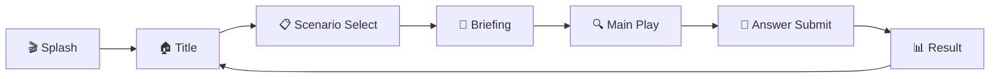
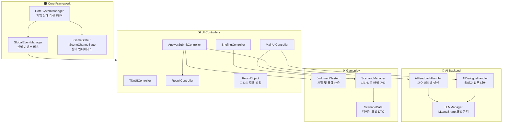

# 🔍 AIClue — AI 기반 추리 수사 시뮬레이션 게임

<p align="center">
  <strong>로컬 LLM을 활용한 몰입형 추리 수사 시뮬레이션</strong><br/>
  용의자를 심문하고, 단서를 수집하고, 범인을 추리하세요.
</p>

<p align="center">
  
  
  
  
  
</p>

---

## 📖 프로젝트 소개

**AIClue**는 로컬 대규모 언어 모델(LLM)을 Unity 게임 엔진에 통합하여, 플레이어가 AI 용의자를 자유롭게 심문하고 수사를 진행하는 **추리 시뮬레이션 게임**입니다.

기존의 선택지 기반 대화 시스템과 달리, 플레이어가 **자연어로 자유롭게 질문**하면 각 용의자의 성격·알리바이·비밀 정보를 기반으로 AI가 실시간으로 응답합니다. 수사 종료 후에는 교수 AI가 플레이어의 수사 과정 전체를 분석하여 피드백을 제공합니다.

### ✨ 주요 특징

- 🗣️ **자연어 심문 시스템** — 정해진 선택지 없이, 원하는 질문을 직접 타이핑하여 용의자를 심문
- 🧠 **완전 오프라인 AI** — Gemma 3 / EXAONE 3.5 모델을 LLamaSharp(Vulkan)를 통해 로컬에서 추론, 인터넷 불필요
- 🗺️ **3×3 그리드 기반 현장 수색** — 9개의 방을 탐색하여 단서를 발견하고 수집
- ⚖️ **객관적 채점 시스템** — 범인·흉기 정답 여부, 수사 효율을 종합한 100점 만점 평가
- 🎓 **교수 AI 피드백** — 수사 종료 후 AI 교수가 등급에 따라 차별화된 톤으로 총평 제공
- 🎬 **역동적 결과 연출** — 검은 화면 채점 대기 → 페이드 아웃 → 순차 카드 등장 → 등급 도장 쾅!
- 🎲 **랜덤화된 배역** — 매 플레이마다 진범·누명 용의자·흉기가 무작위로 배정

---

## 🎮 게임 플로우



| 단계 | 설명 |
|---|---|
| **Splash** | 로컬 AI 모델 로딩(GGUF) 및 시스템 초기화 |
| **Title** | 타이틀 화면, 게임 시작 |
| **Scenario Select** | 시나리오(사건) 선택 |
| **Briefing** | 사건 개요, 피해자 정보, 용의자 프로필 브리핑 (롤아웃 애니메이션) |
| **Main Play** | 용의자 심문 (AI 대화) · 3×3 현장 수색 · 단서 일람 · 대화 기록 열람 |
| **Answer Submit** | 범인 및 흉기 최종 선택 후 제출 |
| **Result** | 검은 화면에서 교수 AI 채점 대기 → 페이드 아웃 → 카드 순차 등장 → 등급 도장 → 피드백 확인 |

---

## 🏗️ 시스템 아키텍처



### 핵심 설계 패턴

| 패턴 | 적용 위치 | 설명 |
|---|---|---|
| **Finite State Machine** | `CoreSystemManager` | 7개 게임 상태 간 전환 관리, 씬 로딩 및 UI 전환 자동화 |
| **Observer (Pub/Sub)** | `GlobalEventManager` | UI와 로직의 완전한 디커플링, `GameEventType` enum 기반 이벤트 발행/구독 |
| **Singleton** | `CoreSystemManager`, `LLMManager`, `ScenarioManager` | 전역 매니저 인스턴스 보장, `DontDestroyOnLoad` |
| **Async/Await** | `LLMManager`, `AIDialogueHandler`, `AIFeedbackHandler` | LLM 추론의 비동기 처리로 UI 프리징 방지 |
| **Strategy** | `AIDialogueHandler`, `AIFeedbackHandler` | 역할(진범/누명/무고)별 프롬프트, 등급별 교수 페르소나 차별화 |
| **DTO** | `ScenarioData`, `CharacterData`, `WeaponData`, `EvidenceData` | JSON 직렬화 가능한 순수 데이터 객체 |

---

## 📂 프로젝트 구조

```
AIClue/
├── Assets/
│   ├── Script/                              # C# 스크립트
│   │   ├── Core/                            # 핵심 프레임워크
│   │   │   ├── CoreSystemManager.cs         #   게임 상태 머신 (Singleton FSM)
│   │   │   ├── GlobalEventManager.cs        #   전역 이벤트 버스 (Pub/Sub)
│   │   │   ├── Interfaces/                  #   IGameState, ILoadingTask
│   │   │   ├── States/                      #   7개 게임 상태 구현 클래스
│   │   │   └── LoadingTasks/                #   비동기 로딩 태스크
│   │   ├── AIBackend/                       # AI 추론 레이어
│   │   │   ├── LLMManager.cs                #   LLamaSharp 모델 로딩/추론/VRAM 관리
│   │   │   ├── AIDialogueHandler.cs         #   역할별 프롬프트 구성 및 심문 대화
│   │   │   ├── AIFeedbackHandler.cs         #   등급별 교수 AI 피드백 생성
│   │   │   └── PreLoader.cs                 #   모델 사전 로딩
│   │   ├── Gameplay/                        # 게임플레이 시스템
│   │   │   └── JudgmentSystem.cs            #   채점 엔진 (ReportCard 산출)
│   │   ├── Scenario/                        # 시나리오 데이터
│   │   │   ├── ScenarioData.cs              #   DTO: 캐릭터, 단서, 무기, 시나리오
│   │   │   └── ScenarioManager.cs           #   JSON 로딩, 배역 랜덤 배정, 스프라이트 캐시
│   │   ├── MainUIController.cs              # 메인 플레이 HUD (심문/수색 모드 전환)
│   │   ├── BriefingController.cs            # 사건 브리핑 (롤아웃 연출)
│   │   ├── AnswerSubmitController.cs        # 최종 추리 제출 → AI 피드백 요청
│   │   ├── ResultController.cs              # 결과 리포트 연출 (로딩/팝인/스탬프/셰이크)
│   │   ├── RoomObject.cs                    # 3×3 그리드 탐색 타일 (포인터 이벤트)
│   │   ├── ChatView.cs                      # 채팅 UI 뷰
│   │   ├── ExplorationController.cs         # 탐색 모드 컨트롤러
│   │   └── TitleUIController.cs             # 타이틀 화면
│   ├── Scenes/                              # Unity 씬
│   │   ├── Splash.unity                     #   로딩 및 초기화
│   │   ├── Title.unity                      #   타이틀 메뉴
│   │   ├── Briefing.unity                   #   사건 브리핑
│   │   ├── Main.unity                       #   메인 플레이 (심문 + 수색)
│   │   └── Result.unity                     #   수사 결과 리포트
│   ├── StreamingAssets/                     # 런타임 데이터
│   │   ├── Models/                          #   GGUF LLM 모델 파일
│   │   │   ├── gemma-3-4b-it-Q4_K_M.gguf   #     Gemma 3 4B (≈2.5GB)
│   │   │   ├── gemma-3-12b-it-qat-*.gguf   #     Gemma 3 12B (≈7.3GB)
│   │   │   └── EXAONE-3.5-7.8B-*.gguf      #     EXAONE 3.5 7.8B (≈4.8GB)
│   │   └── Scenario/                        #   시나리오 JSON + 이미지
│   │       └── CASE_001/                    #     "베들레이 대저택의 비명"
│   │           ├── CASE_001.json            #       사건 데이터
│   │           ├── img_suspects/            #       용의자 초상화 (6인)
│   │           └── img_evidences/           #       단서 이미지 (6종)
│   ├── Images/                              # 이미지 에셋
│   │   ├── backgrounds/                     #   배경 이미지
│   │   ├── characters/                      #   캐릭터 초상화
│   │   ├── evidences/                       #   단서 아이콘
│   │   └── ui/                              #   UI 요소
│   ├── Fonts/                               # 폰트 에셋
│   ├── Models/                              # 3D 모델
│   └── Prefabs/                             # 프리팹
├── Packages/                                # Unity 패키지 설정
├── ProjectSettings/                         # 프로젝트 설정
└── README.md
```

---

## 🎯 채점 시스템

`JudgmentSystem`이 플레이어의 수사 결과를 100점 만점으로 평가합니다.

| 항목 | 배점 | 설명 |
|---|---|---|
| 범인 추리 | **40점** | 올바른 범인 지목 시 만점 |
| 흉기 추리 | **40점** | 올바른 흉기 지목 시 만점 |
| 수사 효율 | **20점** | 탐색 횟수 + 심문 횟수에 기반한 효율 평가 |

| 등급 | 점수 범위 | 교수 AI 반응 |
|---|---|---|
| **A+** | 90점 이상 | 칭찬과 감탄 |
| **B0** | 70 ~ 89점 | 효율 개선 조언 |
| **C+** | 40 ~ 69점 | 냉철한 지적 |
| **F** | 40점 미만 | 분노의 질타 |

---

## 🧠 AI 시스템 상세

### 지원 모델

| 모델 | 크기 | 양자화 | 용도 |
|---|---|---|---|
| **Gemma 3 4B Instruct** | ≈2.5 GB | Q4_K_M | 경량 모드 (빠른 응답) |
| **EXAONE 3.5 7.8B Instruct** | ≈4.8 GB | Q4_K_M | 표준 모드 |
| **Gemma 3 12B Instruct** | ≈7.3 GB | Q4_K_M | 고품질 모드 (최고 응답 품질) |

### 프롬프트 엔지니어링

- **진범(True Culprit)**: "절대 자백하지 마라" 지시 + 캐릭터 성격/알리바이/비밀 정보 주입
- **누명 용의자(False Culprit)**: "결백을 주장하라" 지시 + 약간의 의심스러운 정황 부여
- **무고한 용의자(Innocent)**: "완전히 결백하다" 지시 + 순수한 반응
- 용의자당 최대 **9턴** 심문 제한, 슬라이딩 윈도우(최근 8개)로 컨텍스트 관리

### 교수 피드백 페르소나

등급에 따라 교수 AI의 성격과 어투가 극적으로 달라집니다:
- **A+**: 극찬하며 미래의 명탐정이라 칭찬
- **B0**: 냉정하게 개선점 지적
- **C+**: 날카롭게 허점을 짚어내며 질타
- **F**: 분노에 차서 수사관 자격 의심

---

## 🛠️ 기술 스택

| 분류 | 기술 | 버전 |
|---|---|---|
| **게임 엔진** | Unity 6 LTS | 6000.3.11f1 |
| **렌더 파이프라인** | Universal Render Pipeline (URP) | 17.3.0 |
| **프로그래밍 언어** | C# | 12.0 |
| **AI 추론 라이브러리** | LLamaSharp | 0.26.0 |
| **GPU 백엔드** | LLamaSharp.Backend.Vulkan | 0.26.0 |
| **AI 모델** | Gemma 3 (4B / 12B), EXAONE 3.5 (7.8B) | GGUF Q4_K_M |
| **UI 프레임워크** | TextMeshPro + Unity UI (uGUI) | 3.2.0 / 2.0.0 |
| **JSON 직렬화** | Newtonsoft.Json (Unity) | 3.2.2 |
| **입력 시스템** | Unity Input System | 1.19.0 |

---

## 🚀 시작하기

### 요구 사양

| 항목 | 최소 사양 | 권장 사양 |
|---|---|---|
| **OS** | Windows 10 64-bit | Windows 11 64-bit |
| **RAM** | 8 GB | 16 GB |
| **GPU** | Vulkan 지원 GPU | VRAM 6GB 이상 GPU |
| **저장 공간** | 8 GB (4B 모델 기준) | 20 GB (전체 모델 포함) |
| **Unity** | Unity 6 (6000.3.11f1) | Unity 6 (6000.3.11f1) |

### 설치 및 실행

```bash
# 1. 저장소 클론
git clone https://github.com/REndPaper/AIClue.git
cd AIClue

# 2. Unity Hub에서 프로젝트 열기
#    Unity 6 (6000.3.11f1) 버전 필요

# 3. AI 모델 파일 확인
#    Assets/StreamingAssets/Models/ 디렉토리에 GGUF 모델 파일 배치
#    (최소 gemma-3-4b-it-Q4_K_M.gguf 필요, ≈2.5GB)

# 4. Unity Editor에서 Splash 씬(Assets/Scenes/Splash.unity)을 열고 Play
```

> [!IMPORTANT]
> GGUF 모델 파일은 용량이 크므로(2.5~7.3GB) 별도 다운로드하여 `Assets/StreamingAssets/Models/` 디렉토리에 배치해야 합니다.
> [Gemma 3 4B](https://huggingface.co/unsloth/gemma-3-4b-it-qat-GGUF)
> [Exaone 3.5 7.8B](https://huggingface.co/LGAI-EXAONE/EXAONE-3.5-7.8B-Instruct-GGUF)
> [Gemma 3 12B(int4)](https://huggingface.co/unsloth/gemma-3-12b-it-qat-int4-GGUF)
> 모든 모델은 Q4_K_M 양자화 버전을 사용하였습니다.

> [!TIP]
> Vulkan을 지원하는 GPU가 있으면 `LLamaSharp.Backend.Vulkan`이 자동으로 GPU 가속을 활용합니다. CPU만으로도 실행 가능하지만 응답 속도가 현저히 느려질 수 있습니다.

---

## 📋 시나리오 구조

시나리오 데이터는 `Assets/StreamingAssets/Scenario/` 아래의 JSON 파일과 이미지 에셋으로 구성됩니다.

```
CASE_001/
├── CASE_001.json          # 사건 데이터 (한국어)
├── img_suspects/          # 용의자 초상화 (CHAR_01 ~ CHAR_06)
├── img_evidences/         # 단서 이미지 (BRK_01 ~ BRK_06)
├── img_rooms/             # 방 이미지 (예정)
└── img_weapons/           # 흉기 이미지 (예정)
```

### JSON 데이터 예시

```jsonc
{
  "caseNo": "CASE_001",
  "caseName": "베들레이 대저택의 비명",
  "overview": "...",
  "victim": "...",
  "place": "베들레이 대저택",
  "objective": "...",
  "gridMap": [                    // 3×3 방 그리드
    ["서재", "복도", "거실"],
    ["주방", "취조실", "식당"],
    ["정원", "차고", "지하실"]
  ],
  "characters": [                 // 용의자 6인 (런타임에 3인 랜덤 배정)
    {
      "id": "CHAR_01",
      "name": "에드워드",
      "personality": "침착하고 냉정한",
      "alibi": "서재에서 독서 중이었다",
      "breakerEvidence": { "id": "BRK_01", "name": "...", "description": "..." }
    }
    // ...
  ],
  "weapons": [                    // 흉기 9종 (런타임에 2개 랜덤 배정)
    {
      "id": "WPN_01",
      "name": "부엌칼",
      "evidences": [ /* 흉기별 단서 5개 */ ]
    }
    // ...
  ]
}
```

새로운 시나리오를 추가하려면 위 형식에 맞춰 JSON 파일을 작성하고, 대응하는 이미지를 함께 `StreamingAssets/Scenario/` 아래에 배치하면 됩니다.

---

## 📅 개발 이력

| 날짜 | 마일스톤 |
|---|---|
| 2025-04-01 | 🎬 Unity 프로젝트 초기 생성 및 기본 환경 설정 |
| 2025-04-02 | 🧠 LLamaSharp 도입 및 로컬 AI 추론 시스템(`LLMManager`) 구축 |
| 2025-05-06 | 🎛️ 게임 핵심 상태 머신(FSM) 및 비동기 이벤트 프레임워크 구축, 타이틀 UI 구현 |
| 2025-05-10 | 🔗 AI 아키텍처·상태 머신·판정 시스템 통합, 시나리오 데이터 구조 확립 |
| 2025-05-10 | 🏠 메인 플레이 씬(심문실) 기초 환경 구성 |
| 2025-05-11 | 💬 채팅창·단서 인벤토리·대화 기록 UI 구현 |
| 2025-05-12 | ✅ 최종 추리 및 결과 시스템 완성, 교수 AI 피드백 연출, 역동적 결과 화면 애니메이션 |
| 2025-06-16 | ✅ 피드백 내용 반영(브리핑 추가 및 밸런싱 위한 로그 수집), 전체적인 UI 개선 |

---
