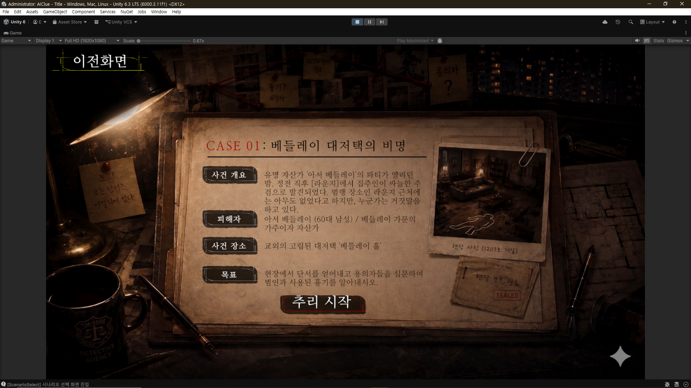
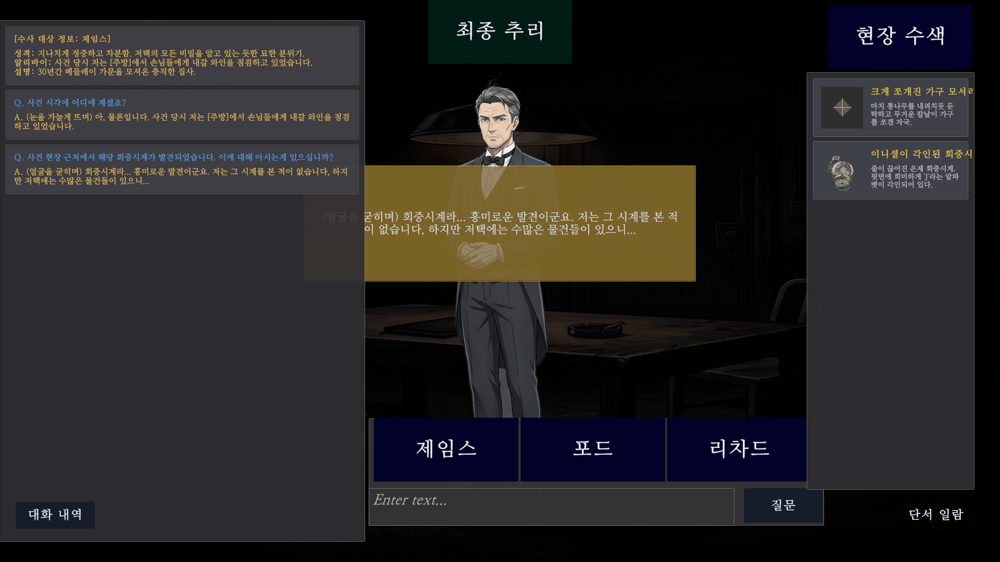

# AIClue

Unity에서 로컬 LLM을 구동해 용의자와 자연어로 대화하는 추리 게임 프로토타입입니다. 사건의 정답과 채점은 게임 로직이 담당하고, AI는 용의자의 답변과 수사 결과 피드백을 생성합니다.

| 항목 | 내용 |
| --- | --- |
| 개발 기간 | 2026.03 - 2026.06 |
| 개발 형태 | 성공회대학교 컴퓨터공학 캡스톤, 3인 팀 |
| 담당 | 팀장, 게임 기획·핵심 시스템 설계 및 구현, 로컬 LLM 연동 |
| 기술 | Unity 6, C#, LLamaSharp 0.26.0, Vulkan 백엔드, Newtonsoft.Json |
| 상태 | 캡스톤 프로토타입, 시연 완료 |

▶️ [AIClue 플레이 데모 영상](https://youtu.be/9-_zO0C5KLo)



## 플레이 방식

사건 선택과 브리핑을 거쳐 용의자를 심문하고 3×3 공간에서 단서를 수집합니다. 범인과 흉기를 제출하면 게임 로직이 점수와 등급을 계산하고, 교수 역할의 AI가 확정된 수사 결과에 대한 피드백 문장을 생성합니다.

- JSON 시나리오에서 용의자·흉기·단서 데이터를 읽습니다.
- 플레이마다 용의자 3명의 역할과 실제·가짜 흉기를 배정합니다.
- 자유 입력 질문에 역할·성격·알리바이·단서 정보를 반영해 답변합니다.
- 중앙을 제외한 8개 수색 위치에 단서를 배치합니다.
- 범인·흉기 정답은 각각 40점, 수사 효율은 최대 20점으로 계산합니다.



## 담당 범위

게임 기획과 핵심 코드 구조를 설계하고, 로컬 모델 로딩·추론, 심문 프롬프트 구성, 게임 상태 전환을 구현했습니다. 팀원은 에셋 제작, 씬 구성, 인터랙션과 비주얼 연출, 플레이 문제 확인에 참여했습니다.

## 주요 구현

### 1. 게임 규칙과 생성 모델의 책임 분리

사건의 정답과 채점은 C# 로직에서 결정하고, LLM은 대화와 피드백을 생성합니다. 생성 응답이 달라져도 정답 데이터와 점수 계산식은 유지됩니다.

| 모듈 | 책임 |
| --- | --- |
| [ScenarioManager](Assets/Script/Scenario/ScenarioManager.cs) | JSON 로딩, 배역·흉기 선택, 단서 배치 |
| [JudgmentSystem](Assets/Script/Gameplay/JudgmentSystem.cs) | 정답 비교, 효율 점수 및 등급 계산 |
| [AIDialogueHandler](Assets/Script/AIBackend/AIDialogueHandler.cs) | 용의자 역할과 단서, 현재 심문 기록을 프롬프트로 구성 |
| [AIFeedbackHandler](Assets/Script/AIBackend/AIFeedbackHandler.cs) | 확정된 수사 결과를 바탕으로 교수 코멘트 요청 |

게임 데이터를 프롬프트의 컨텍스트로 전달하며, 별도 모델 학습 없이 상황에 맞는 응답을 요청합니다.

### 2. 로컬 모델의 로딩·추론·자원 해제

[LLMManager](Assets/Script/AIBackend/LLMManager.cs)에서 모델 가중치와 추론 객체를 관리합니다.

- 무거운 모델 로딩은 `Task.Run`으로 분리합니다.
- `InferAsync`를 `await foreach`로 소비해 생성 결과를 누적합니다. 현재 UI에는 완성된 응답을 반환하며 토큰별 UI 스트리밍은 아닙니다.
- 동일 모델의 중복 로딩을 건너뛰고, 생성 중인 요청이 있으면 추가 생성을 거절합니다.
- 모델 변경 시 `LLamaContext`와 `LLamaWeights`를 `Dispose`합니다.
- 상위 옵션 모델의 로딩에 실패하면 기본 모델로 재시도합니다. 기본 모델마저 실패했을 때의 복구 UX는 보완 대상입니다.

### 3. 출력 형식 통제와 UI 결합도 완화

플레이어 대사나 코드 블록이 응답에 섞이는 문제에 대응해 AntiPrompt, 생성 문자열 중단 검사, 반환 전 정리를 적용했습니다. 심문과 교수 피드백에는 서로 다른 줄바꿈 중단 조건을 사용합니다. 출력 형식 제어와 별개로 답변의 사실 일치는 추가 검증 대상입니다.

[CoreSystemManager](Assets/Script/Core/CoreSystemManager.cs)는 7개 상태를 관리하고 씬 전환과 UI 전환을 구분합니다. [GlobalEventManager](Assets/Script/Core/GlobalEventManager.cs)를 통해 질문·응답·로딩 이벤트를 전달합니다. 다만 일부 매니저 직접 참조도 있으므로 전체 시스템이 완전히 분리된 구조는 아닙니다.

### 4. Vulkan 백엔드의 CPU fallback 구성 문제 해결

`LLamaSharp.Backend.Vulkan`을 NuGet으로 구성했을 때 CPU fallback에 필요한 네이티브 라이브러리가 빠져 정상 실행되지 않았습니다. CPU 백엔드 패키지를 함께 설치하면 네이티브 라이브러리가 충돌해, CPU 백엔드에서 `ggml-cpu.dll`만 별도로 확보한 뒤 Vulkan 백엔드에 직접 배치해 실행 구성을 맞췄습니다.

이후 RTX 2060 환경에서 Vulkan GPU offload를 사용하는 로컬 추론이 정상 동작하는 것을 확인했습니다.

### 5. 모델 교체 시 VRAM 회수 확인

Development Build에서 모델 교체 전후 전용 GPU 메모리를 확인했습니다.

| 전환 단계 | 전용 GPU 메모리 |
| --- | ---: |
| Gemma 3 4B 로드 후 | 약 4.8 GB |
| EXAONE 3.5 7.8B로 교체 | 약 5.1 GB |
| Gemma 3 4B로 재교체 | 약 4.5 GB |

작업 관리자 기준의 관찰값이며 정밀 벤치마크 수치는 아닙니다. 다만 4B → 7.8B → 4B 전환 후 메모리가 이전 수준으로 복귀해, 모델 교체 과정에서 전용 GPU 메모리가 지속적으로 누적되지 않는 것을 확인했습니다. Unity Profiler에서는 네이티브 자원의 일부가 `Untracked` 영역으로 관찰되었습니다.

## 핵심 코드 위치

| 경로 | 살펴볼 내용 |
| --- | --- |
| `Assets/Script/Core/` | 상태 인터페이스, 상태별 구현, 로딩 태스크 |
| `Assets/Script/AIBackend/` | 모델 생명주기, 대화 및 피드백 처리 |
| `Assets/Script/Scenario/` | 시나리오 데이터와 자원 관리 |
| `Assets/Script/Gameplay/` | 규칙 기반 채점 |
| `Assets/StreamingAssets/Scenario/` | 사건 JSON과 시나리오 자원 |

## 빠른 시작

개발 환경은 Windows, Unity `6000.3.11f1`, RTX 2060 6GB입니다. 아래는 기본 4B 모델로 실행하는 절차입니다. GPU는 개발에 사용한 장비이며 최소 사양을 의미하지 않습니다.

### 1. 프로젝트와 패키지 준비

```bash
git clone https://github.com/REndPaper/AIClue.git
```

Unity Hub에서 프로젝트 폴더를 추가하고 위 버전의 Editor로 엽니다. [Packages/manifest.json](Packages/manifest.json)의 Unity 패키지를 복원하고, NuGet 패키지는 [Assets/packages.config](Assets/packages.config)의 버전을 기준으로 준비합니다. Editor의 NuGet 메뉴에서 패키지 복원 상태를 확인합니다.

| 주요 의존성 | 버전 | 용도 |
| --- | --- | --- |
| LLamaSharp | 0.26.0 | 모델 로딩·추론 |
| LLamaSharp.Backend.Vulkan | 0.26.0 | Vulkan 백엔드 |
| LLamaSharp.Backend.Vulkan.Windows | 0.26.0 | Windows 네이티브 백엔드 |
| com.unity.nuget.newtonsoft-json | 3.2.2 | 시나리오 JSON 처리 |

표는 주요 항목만 요약한 것입니다. 전체 의존성은 두 설정 파일을 따르며, 네이티브 라이브러리와 Vulkan 지원 그래픽 드라이버도 필요합니다.

### 2. 기본 모델 배치

기본 모델은 기존 프로젝트에서 안내하는 [Gemma 3 4B QAT GGUF 배포 페이지](https://huggingface.co/unsloth/gemma-3-4b-it-qat-GGUF)에서 준비합니다.

1. **Files and versions**에서 `gemma-3-4b-it-qat-Q4_K_M.gguf`를 내려받습니다. [Q4_K_M 파일 보기](https://huggingface.co/unsloth/gemma-3-4b-it-qat-GGUF/blob/main/gemma-3-4b-it-qat-Q4_K_M.gguf)
2. `Assets/StreamingAssets/Models/` 폴더를 만들고 파일을 넣습니다.
3. 코드의 기본 경로를 그대로 사용할 경우 파일명을 `gemma-3-4b-it-Q4_K_M.gguf`로 바꿉니다. 원래 파일명을 유지하려면 `LLMManager`의 `modelpaths[0]`을 `Models/gemma-3-4b-it-qat-Q4_K_M.gguf`로 맞춥니다.

다운로드 파일에는 `qat`가 들어 있지만 코드 기본값에는 없으므로, 실제 파일명과 로딩 경로를 일치시켜야 합니다. 아래는 [LLMManager](Assets/Script/AIBackend/LLMManager.cs)의 코드 기본값입니다.

| 항목 | 값 |
| --- | --- |
| 기본 모델 인덱스 | `0` |
| 코드에서 찾는 파일명 | `gemma-3-4b-it-Q4_K_M.gguf` |
| 프로젝트 내 배치 경로 | `Assets/StreamingAssets/Models/gemma-3-4b-it-Q4_K_M.gguf` |
| 컨텍스트 크기 | `4096` |
| GPU 오프로딩 레이어 설정 | `15` |

Unity Inspector에 직렬화된 `modelpaths` 값이 있으면 코드 초기값보다 우선하므로 함께 확인합니다. 위 이름 변경은 로딩 경로를 맞추는 절차이며 모델 형식 변환은 아닙니다. 모델의 이용 조건은 각 배포 페이지를 따릅니다.

### 3. 시작 씬 실행

1. [Splash 씬](Assets/Scenes/Splash.unity)을 열고 Play를 누릅니다.
2. 모델 로딩이 끝난 뒤 타이틀·사건 선택·브리핑 순서로 진행합니다.
3. 심문 화면에서 질문을 입력하고 응답이 표시되는지 확인합니다.
4. 수색 후 범인·흉기를 제출해 채점과 피드백까지 진행합니다.

이전에 다른 모델을 선택했다면 `PlayerPrefs`의 `SelectedModelIndex`가 우선 적용됩니다. 기본 모델만 준비한 경우 게임의 모델 옵션도 기본값으로 맞춥니다. 다른 모델 옵션을 사용할 때는 아래 배포 페이지에서 **Q4_K_M** 가중치를 별도로 준비하고, 같은 방식으로 파일명과 `modelpaths`를 맞춥니다. 모든 모델을 내려받을 필요는 없습니다.

| 모델 인덱스 | 다운로드 페이지 | 코드에서 찾는 파일명 |
| --- | --- | --- |
| `0` · 기본 | [Gemma 3 4B](https://huggingface.co/unsloth/gemma-3-4b-it-qat-GGUF) | `gemma-3-4b-it-Q4_K_M.gguf` |
| `1` | [EXAONE 3.5 7.8B](https://huggingface.co/LGAI-EXAONE/EXAONE-3.5-7.8B-Instruct-GGUF) | `EXAONE-3.5-7.8B-Instruct-Q4_K_M.gguf` |
| `2` | [Gemma 3 12B](https://huggingface.co/unsloth/gemma-3-12b-it-qat-int4-GGUF) | `gemma-3-12b-it-qat-int4-Q4_K_M.gguf` |

### 실행 중 확인할 사항

| 증상 | 확인할 항목 |
| --- | --- |
| 모델 파일을 찾지 못함 | `StreamingAssets/Models`의 파일과 Inspector의 `modelpaths`, 선택한 모델 인덱스 |
| 네이티브 라이브러리 로딩 오류 | OS에 맞는 Vulkan 백엔드, 패키지 복원, 그래픽 드라이버, `ggml-cpu.dll` 배치 |
| 로딩 실패·메모리 부족 | 기본 4B 모델 선택 여부, 컨텍스트·GPU 오프로딩 설정, Console 예외 |

모델 로딩 성공 시 Console에 `모델 로딩 완료! 심문 준비가 끝났습니다.`가 표시됩니다. 실패 원인은 같은 위치의 예외 메시지에서 확인합니다.

## 현재 한계와 다음 개선

- 추리의 일관성, 반복 플레이의 재미, 난이도에 대한 추가 사용자 검증이 필요합니다.
- 심문 대상을 바꾸면 현재 대화 기록과 턴 수를 초기화합니다. NPC별 세션 보존은 아직 구현하지 않았습니다.
- 최근 발화 목록을 줄여 입력 증가를 제한하지만 정확한 토큰 예산 관리는 아닙니다.
- 모델 교체와 진행 중인 추론의 동시성, 취소 처리, 로딩 실패 표시를 강화할 필요가 있습니다.
- 플랫폼별 네이티브 라이브러리와 파일 경로 처리를 추가 검증해야 합니다.
- 모델 교체 전후의 GPU 메모리는 확인했지만, 프레임 시간과 추론 지연에 대한 정량 측정은 추가 과제입니다.
