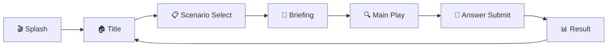
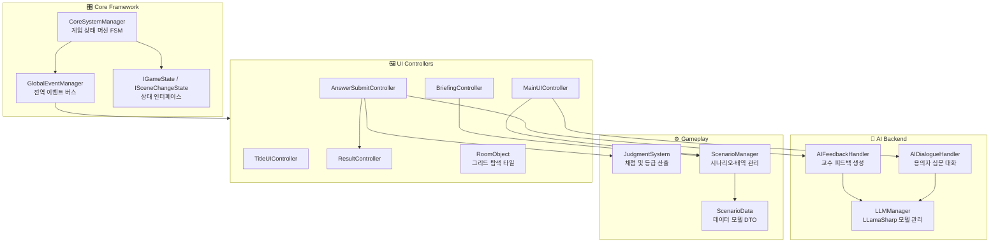

# 🔍 AIClue — AI 기반 추리 수사 시뮬레이션 게임

<p align="center">
  <strong>로컬 LLM을 활용한 몰입형 추리 수사 시뮬레이션</strong><br/>
  용의자를 심문하고, 단서를 수집하고, 범인을 추리하세요.
</p>

<p align="center">
  
  
  
  
  
</p>

---

## 📖 프로젝트 소개

**AIClue**는 로컬 대규모 언어 모델(LLM)을 Unity 게임 엔진에 통합하여, 플레이어가 AI 용의자를 자유롭게 심문하고 수사를 진행하는 **추리 시뮬레이션 게임**입니다.

기존의 선택지 기반 대화 시스템과 달리, 플레이어가 **자연어로 자유롭게 질문**하면 각 용의자의 성격·알리바이·비밀 정보를 기반으로 AI가 실시간으로 응답합니다. 수사 종료 후에는 교수 AI가 플레이어의 수사 과정 전체를 분석하여 피드백을 제공합니다.

### ✨ 주요 특징

- 🗣️ **자연어 심문 시스템** — 정해진 선택지 없이, 원하는 질문을 직접 타이핑하여 용의자를 심문
- 🧠 **완전 오프라인 AI** — Gemma 3 / EXAONE 3.5 모델을 LLamaSharp(Vulkan)를 통해 로컬에서 추론, 인터넷 불필요
- 🗺️ **3×3 그리드 기반 현장 수색** — 9개의 방을 탐색하여 단서를 발견하고 수집
- ⚖️ **객관적 채점 시스템** — 범인·흉기 정답 여부, 수사 효율을 종합한 100점 만점 평가
- 🎓 **교수 AI 피드백** — 수사 종료 후 AI 교수가 등급에 따라 차별화된 톤으로 총평 제공
- 🎬 **역동적 결과 연출** — 검은 화면 채점 대기 → 페이드 아웃 → 순차 카드 등장 → 등급 도장 쾅!
- 🎲 **랜덤화된 배역** — 매 플레이마다 진범·누명 용의자·흉기가 무작위로 배정

---

## 🎮 게임 플로우



| 단계 | 설명 |
|---|---|
| **Splash** | 로컬 AI 모델 로딩(GGUF) 및 시스템 초기화 |
| **Title** | 타이틀 화면, 게임 시작 |
| **Scenario Select** | 시나리오(사건) 선택 |
| **Briefing** | 사건 개요, 피해자 정보, 용의자 프로필 브리핑 (롤아웃 애니메이션) |
| **Main Play** | 용의자 심문 (AI 대화) · 3×3 현장 수색 · 단서 일람 · 대화 기록 열람 |
| **Answer Submit** | 범인 및 흉기 최종 선택 후 제출 |
| **Result** | 검은 화면에서 교수 AI 채점 대기 → 페이드 아웃 → 카드 순차 등장 → 등급 도장 → 피드백 확인 |

---

## 🏗️ 시스템 아키텍처



### 핵심 설계 패턴

| 패턴 | 적용 위치 | 설명 |
|---|---|---|
| **Finite State Machine** | `CoreSystemManager` | 7개 게임 상태 간 전환 관리, 씬 로딩 및 UI 전환 자동화 |
| **Observer (Pub/Sub)** | `GlobalEventManager` | UI와 로직의 완전한 디커플링, `GameEventType` enum 기반 이벤트 발행/구독 |
| **Singleton** | `CoreSystemManager`, `LLMManager`, `ScenarioManager` | 전역 매니저 인스턴스 보장, `DontDestroyOnLoad` |
| **Async/Await** | `LLMManager`, `AIDialogueHandler`, `AIFeedbackHandler` | LLM 추론의 비동기 처리로 UI 프리징 방지 |
| **Strategy** | `AIDialogueHandler`, `AIFeedbackHandler` | 역할(진범/누명/무고)별 프롬프트, 등급별 교수 페르소나 차별화 |
| **DTO** | `ScenarioData`, `CharacterData`, `WeaponData`, `EvidenceData` | JSON 직렬화 가능한 순수 데이터 객체 |

---

## 📂 프로젝트 구조

```
AIClue/
├── Assets/
│   ├── Script/                              # C# 스크립트
│   │   ├── Core/                            # 핵심 프레임워크
│   │   │   ├── CoreSystemManager.cs         #   게임 상태 머신 (Singleton FSM)
│   │   │   ├── GlobalEventManager.cs        #   전역 이벤트 버스 (Pub/Sub)
│   │   │   ├── Interfaces/                  #   IGameState, ILoadingTask
│   │   │   ├── States/                      #   7개 게임 상태 구현 클래스
│   │   │   └── LoadingTasks/                #   비동기 로딩 태스크
│   │   ├── AIBackend/                       # AI 추론 레이어
│   │   │   ├── LLMManager.cs                #   LLamaSharp 모델 로딩/추론/VRAM 관리
│   │   │   ├── AIDialogueHandler.cs         #   역할별 프롬프트 구성 및 심문 대화
│   │   │   ├── AIFeedbackHandler.cs         #   등급별 교수 AI 피드백 생성
│   │   │   └── PreLoader.cs                 #   모델 사전 로딩
│   │   ├── Gameplay/                        # 게임플레이 시스템
│   │   │   └── JudgmentSystem.cs            #   채점 엔진 (ReportCard 산출)
│   │   ├── Scenario/                        # 시나리오 데이터
│   │   │   ├── ScenarioData.cs              #   DTO: 캐릭터, 단서, 무기, 시나리오
│   │   │   └── ScenarioManager.cs           #   JSON 로딩, 배역 랜덤 배정, 스프라이트 캐시
│   │   ├── MainUIController.cs              # 메인 플레이 HUD (심문/수색 모드 전환)
│   │   ├── BriefingController.cs            # 사건 브리핑 (롤아웃 연출)
│   │   ├── AnswerSubmitController.cs        # 최종 추리 제출 → AI 피드백 요청
│   │   ├── ResultController.cs              # 결과 리포트 연출 (로딩/팝인/스탬프/셰이크)
│   │   ├── RoomObject.cs                    # 3×3 그리드 탐색 타일 (포인터 이벤트)
│   │   ├── ChatView.cs                      # 채팅 UI 뷰
│   │   ├── ExplorationController.cs         # 탐색 모드 컨트롤러
│   │   └── TitleUIController.cs             # 타이틀 화면
│   ├── Scenes/                              # Unity 씬
│   │   ├── Splash.unity                     #   로딩 및 초기화
│   │   ├── Title.unity                      #   타이틀 메뉴
│   │   ├── Briefing.unity                   #   사건 브리핑
│   │   ├── Main.unity                       #   메인 플레이 (심문 + 수색)
│   │   └── Result.unity                     #   수사 결과 리포트
│   ├── StreamingAssets/                     # 런타임 데이터
│   │   ├── Models/                          #   GGUF LLM 모델 파일
│   │   │   ├── gemma-3-4b-it-Q4_K_M.gguf   #     Gemma 3 4B (≈2.5GB)
│   │   │   ├── gemma-3-12b-it-qat-*.gguf   #     Gemma 3 12B (≈7.3GB)
│   │   │   └── EXAONE-3.5-7.8B-*.gguf      #     EXAONE 3.5 7.8B (≈4.8GB)
│   │   └── Scenario/                        #   시나리오 JSON + 이미지
│   │       └── CASE_001/                    #     "베들레이 대저택의 비명"
│   │           ├── CASE_001.json            #       사건 데이터
│   │           ├── img_suspects/            #       용의자 초상화 (6인)
│   │           └── img_evidences/           #       단서 이미지 (6종)
│   ├── Images/                              # 이미지 에셋
│   │   ├── backgrounds/                     #   배경 이미지
│   │   ├── characters/                      #   캐릭터 초상화
│   │   ├── evidences/                       #   단서 아이콘
│   │   └── ui/                              #   UI 요소
│   ├── Fonts/                               # 폰트 에셋
│   ├── Models/                              # 3D 모델
│   └── Prefabs/                             # 프리팹
├── Packages/                                # Unity 패키지 설정
├── ProjectSettings/                         # 프로젝트 설정
└── README.md
```

---

## 🎯 채점 시스템

`JudgmentSystem`이 플레이어의 수사 결과를 100점 만점으로 평가합니다.

| 항목 | 배점 | 설명 |
|---|---|---|
| 범인 추리 | **40점** | 올바른 범인 지목 시 만점 |
| 흉기 추리 | **40점** | 올바른 흉기 지목 시 만점 |
| 수사 효율 | **20점** | 탐색 횟수 + 심문 횟수에 기반한 효율 평가 |

| 등급 | 점수 범위 | 교수 AI 반응 |
|---|---|---|
| **A+** | 90점 이상 | 칭찬과 감탄 |
| **B0** | 70 ~ 89점 | 효율 개선 조언 |
| **C+** | 40 ~ 69점 | 냉철한 지적 |
| **F** | 40점 미만 | 분노의 질타 |

---

## 🧠 AI 시스템 상세

### 지원 모델

| 모델 | 크기 | 양자화 | 용도 |
|---|---|---|---|
| **Gemma 3 4B Instruct** | ≈2.5 GB | Q4_K_M | 경량 모드 (빠른 응답) |
| **EXAONE 3.5 7.8B Instruct** | ≈4.8 GB | Q4_K_M | 표준 모드 |
| **Gemma 3 12B Instruct** | ≈7.3 GB | Q4_K_M | 고품질 모드 (최고 응답 품질) |

### 프롬프트 엔지니어링

- **진범(True Culprit)**: "절대 자백하지 마라" 지시 + 캐릭터 성격/알리바이/비밀 정보 주입
- **누명 용의자(False Culprit)**: "결백을 주장하라" 지시 + 약간의 의심스러운 정황 부여
- **무고한 용의자(Innocent)**: "완전히 결백하다" 지시 + 순수한 반응
- 용의자당 최대 **9턴** 심문 제한, 슬라이딩 윈도우(최근 8개)로 컨텍스트 관리

### 교수 피드백 페르소나

등급에 따라 교수 AI의 성격과 어투가 극적으로 달라집니다:
- **A+**: 극찬하며 미래의 명탐정이라 칭찬
- **B0**: 냉정하게 개선점 지적
- **C+**: 날카롭게 허점을 짚어내며 질타
- **F**: 분노에 차서 수사관 자격 의심

---

## 🛠️ 기술 스택

| 분류 | 기술 | 버전 |
|---|---|---|
| **게임 엔진** | Unity 6 LTS | 6000.3.11f1 |
| **렌더 파이프라인** | Universal Render Pipeline (URP) | 17.3.0 |
| **프로그래밍 언어** | C# | 12.0 |
| **AI 추론 라이브러리** | LLamaSharp | 0.26.0 |
| **GPU 백엔드** | LLamaSharp.Backend.Vulkan | 0.26.0 |
| **AI 모델** | Gemma 3 (4B / 12B), EXAONE 3.5 (7.8B) | GGUF Q4_K_M |
| **UI 프레임워크** | TextMeshPro + Unity UI (uGUI) | 3.2.0 / 2.0.0 |
| **JSON 직렬화** | Newtonsoft.Json (Unity) | 3.2.2 |
| **입력 시스템** | Unity Input System | 1.19.0 |

---

## 🚀 시작하기

### 요구 사양

| 항목 | 최소 사양 | 권장 사양 |
|---|---|---|
| **OS** | Windows 10 64-bit | Windows 11 64-bit |
| **RAM** | 8 GB | 16 GB |
| **GPU** | Vulkan 지원 GPU | VRAM 6GB 이상 GPU |
| **저장 공간** | 8 GB (4B 모델 기준) | 20 GB (전체 모델 포함) |
| **Unity** | Unity 6 (6000.3.11f1) | Unity 6 (6000.3.11f1) |

### 설치 및 실행

```bash
# 1. 저장소 클론
git clone https://github.com/REndPaper/AIClue.git
cd AIClue

# 2. Unity Hub에서 프로젝트 열기
#    Unity 6 (6000.3.11f1) 버전 필요

# 3. AI 모델 파일 확인
#    Assets/StreamingAssets/Models/ 디렉토리에 GGUF 모델 파일 배치
#    (최소 gemma-3-4b-it-Q4_K_M.gguf 필요, ≈2.5GB)

# 4. Unity Editor에서 Splash 씬(Assets/Scenes/Splash.unity)을 열고 Play
```

> [!IMPORTANT]
> GGUF 모델 파일은 용량이 크므로(2.5~7.3GB) 별도 다운로드하여 `Assets/StreamingAssets/Models/` 디렉토리에 배치해야 합니다.
> [Gemma 3 4B](https://huggingface.co/unsloth/gemma-3-4b-it-qat-GGUF)
> [Exaone 3.5 7.8B](https://huggingface.co/LGAI-EXAONE/EXAONE-3.5-7.8B-Instruct-GGUF)
> [Gemma 3 12B(int4)](https://huggingface.co/unsloth/gemma-3-12b-it-qat-int4-GGUF)
> 모든 모델은 Q4_K_M 양자화 버전을 사용하였습니다.

> [!TIP]
> Vulkan을 지원하는 GPU가 있으면 `LLamaSharp.Backend.Vulkan`이 자동으로 GPU 가속을 활용합니다. CPU만으로도 실행 가능하지만 응답 속도가 현저히 느려질 수 있습니다.

---

## 📋 시나리오 구조

시나리오 데이터는 `Assets/StreamingAssets/Scenario/` 아래의 JSON 파일과 이미지 에셋으로 구성됩니다.

```
CASE_001/
├── CASE_001.json          # 사건 데이터 (한국어)
├── img_suspects/          # 용의자 초상화 (CHAR_01 ~ CHAR_06)
├── img_evidences/         # 단서 이미지 (BRK_01 ~ BRK_06)
├── img_rooms/             # 방 이미지 (예정)
└── img_weapons/           # 흉기 이미지 (예정)
```

### JSON 데이터 예시

```jsonc
{
  "caseNo": "CASE_001",
  "caseName": "베들레이 대저택의 비명",
  "overview": "...",
  "victim": "...",
  "place": "베들레이 대저택",
  "objective": "...",
  "gridMap": [                    // 3×3 방 그리드
    ["서재", "복도", "거실"],
    ["주방", "취조실", "식당"],
    ["정원", "차고", "지하실"]
  ],
  "characters": [                 // 용의자 6인 (런타임에 3인 랜덤 배정)
    {
      "id": "CHAR_01",
      "name": "에드워드",
      "personality": "침착하고 냉정한",
      "alibi": "서재에서 독서 중이었다",
      "breakerEvidence": { "id": "BRK_01", "name": "...", "description": "..." }
    }
    // ...
  ],
  "weapons": [                    // 흉기 9종 (런타임에 2개 랜덤 배정)
    {
      "id": "WPN_01",
      "name": "부엌칼",
      "evidences": [ /* 흉기별 단서 5개 */ ]
    }
    // ...
  ]
}
```

새로운 시나리오를 추가하려면 위 형식에 맞춰 JSON 파일을 작성하고, 대응하는 이미지를 함께 `StreamingAssets/Scenario/` 아래에 배치하면 됩니다.

---

## 🧩 기술적 난제 및 해결 과정

AIClue는 **로컬 LLM을 실시간 게임 루프에 통합**하는 과정에서 수많은 기술적 도전에 직면했습니다. 아래는 개발 과정에서 마주친 핵심 난제와 그 해결 전략을 정리한 것입니다.

### 1. LLM 추론과 Unity 메인 스레드의 공존 — 비동기 추론 아키텍처

**문제**: LLamaSharp를 통한 LLM 추론은 수 초~수십 초가 소요되는 CPU/GPU 집약적 작업입니다. 이를 Unity의 메인 스레드에서 실행하면 **전체 게임이 프리징**되어 UI가 멈추고 사용자 입력이 차단됩니다.

**해결**:
- 모델 로딩(`LoadModelInternal`)은 `Task.Run()`으로 **백그라운드 스레드**에서 실행하여 GGUF 파일의 무거운 디스크 I/O 및 VRAM 적재 과정이 게임 루프를 차단하지 않도록 분리
- 실제 추론(`GenerateResponseAsync`)은 LLamaSharp의 `InferAsync()` **비동기 스트림**(`IAsyncEnumerable`)을 `await foreach`로 소비하여, 토큰이 생성될 때마다 메인 스레드에 돌아와 UI 갱신 가능
- `_isGenerating` 플래그로 **동시 추론 요청 방지** — 여러 UI 이벤트가 동시에 LLM을 호출하는 Race Condition 차단

```csharp
// 비동기 스트리밍 추론 — 토큰 단위로 yield되므로 UI 블로킹 없음
await foreach (var text in _executor.InferAsync(prompt, inferenceParams))
{
    responseBuilder.Append(text);
    if (ShouldStopGeneration(responseBuilder.ToString(), ...)) break;
}
```

---

### 2. LLM의 통제 불가능한 출력 — 다단계 Anti-Prompt 및 실시간 중단 시스템

**문제**: LLM은 지시와 무관하게 **상대방의 대사를 자체 생성**(예: 용의자가 `Player:`를 출력하며 플레이어 대사까지 만들어냄), **코드 블록 생성**(````로 감싸진 출력), **무한 반복**, **이중 줄바꿈으로 장면 전환** 등 예측 불가능한 출력을 생성합니다. 특히 소형 모델(4B)에서 이러한 현상이 빈번했습니다.

**해결**: 3단계 방어 체계를 구축했습니다.

| 단계 | 메커니즘 | 역할 |
|---|---|---|
| **1차 — 엔진 레벨** | `InferenceParams.AntiPrompts` | LLamaSharp 엔진이 지정된 문자열(`Player:`, `System:`, NPC 이름 등)을 만나면 추론 자체를 중단 |
| **2차 — 실시간 스트림 감시** | `ShouldStopGeneration()` | 토큰이 생성될 때마다 누적 텍스트를 검사하여 `````, `"""`, `\n\n`, 안티프롬프트 감지 시 즉시 `break` |
| **3차 — 후처리 클리닝** | `CleanLLMResponse()` | 생성 완료 후 잔여 아티팩트(따옴표 래핑, 백틱 래핑, NPC 자기 이름 반복 등)를 정규화 |

**핵심 설계 결정**: `stopOnDoubleNewline` 파라미터를 도입하여 **대화 모드**(용의자 심문)와 **자유 텍스트 모드**(교수 피드백)의 중단 규칙을 분리했습니다. 대화에서는 `\n\n`이 턴 경계를 의미하므로 즉시 중단하지만, 교수 피드백에서는 여러 문단에 걸친 자유 줄글이 필요하므로 `\n\n` 중단을 비활성화합니다.

```csharp
// 대화 모드: 엄격한 턴 격리
string response = await LLMManager.Instance.GenerateResponseAsync(prompt, customAntiPrompts, stopOnDoubleNewline: true);

// 교수 피드백 모드: 자유 줄글 허용
string feedback = await LLMManager.Instance.GenerateResponseAsync(sb.ToString(), null, stopOnDoubleNewline: false);
```

---

### 3. VRAM 누수와 모델 Hot-Swap — GPU 리소스 생명주기 관리

**문제**: 사용자가 환경설정에서 AI 모델을 변경(4B → 12B 등)할 때, 기존 모델의 VRAM을 완전히 해제하지 않으면 **GPU 메모리 누수**가 발생합니다. LLamaSharp의 `LLamaWeights`와 `LLamaContext`는 수 GB의 VRAM을 점유하는 네이티브 리소스이며, C#의 GC만으로는 회수되지 않습니다.

**해결**:
- `DisposeAI()` 메서드에서 `_context?.Dispose()` → `_weights?.Dispose()` 순서로 **명시적 Dispose 체인** 실행
- 모든 참조(`_context`, `_weights`, `_executor`)를 `null`로 초기화하여 GC 루트에서 완전 분리
- 모델 교체 시 `DisposeAI()` → `Task.Run(LoadModelInternal)` 순서로 **해제 후 적재** 패턴 보장
- `OnDestroy()` 생명주기 훅에서도 `DisposeAI()` 호출하여 씬 전환/게임 종료 시 누수 방지

```csharp
private void DisposeAI()
{
    _context?.Dispose();  // GPU 컨텍스트 먼저 해제
    _weights?.Dispose();  // 모델 가중치 VRAM 반환
    _context = null;
    _weights = null;
    _executor = null;     // 실행기 참조 제거
}
```

---

### 4. 모델 로딩 실패 시 Graceful Degradation — 자동 폴백 시스템

**문제**: 대형 모델(12B, ≈7.3GB)은 VRAM 부족, 파일 손상, 경로 오류 등으로 로딩에 실패할 수 있습니다. 이때 게임이 크래시되거나 AI 기능이 완전히 비활성화되면 플레이가 불가능합니다.

**해결**: **2단계 자동 폴백 메커니즘**을 구현했습니다.

```
[사용자 선택 모델 로딩 시도]
        │
        ├── 성공 → 정상 진행
        │
        └── 실패 → qualityIndex = 0 (최하옵 Gemma 3 4B)으로 강제 전환
                    │
                    ├── PlayerPrefs에 폴백 인덱스 영구 저장
                    ├── DisposeAI()로 실패한 불완전 리소스 정리
                    ├── 최하옵 모델 재로딩
                    └── OnModelIndexChanged 이벤트 → UI 드롭다운 동기화
```

- `OnModelIndexChanged` 이벤트를 통해 `TitleUIController`의 드롭다운 UI가 **실제 로드된 모델 인덱스와 항상 동기화**
- 모델 변경 중에는 로딩 팝업을 표시하여 사용자에게 진행 상태를 시각적으로 전달
- `PlayerPrefs.Save()`로 폴백 상태를 디스크에 영구 기록하여, 다음 실행 시에도 안정적인 모델로 시작

---

### 5. 유한 상태 머신(FSM) 기반 비동기 씬 관리 — CoreSystemManager 설계

**문제**: 7개의 게임 상태(Splash → Title → ScenarioSelect → Briefing → MainPlay → AnswerSubmit → Result)를 관리하면서, 일부 상태 전환은 **씬 로딩이 필요**하고(SceneChange) 일부는 **UI 전환만**으로 충분합니다(JustFloatUI). 또한 같은 씬 내에서의 상태 전환 시 불필요한 씬 재로딩을 방지해야 합니다.

**해결**: `IGameState` 인터페이스에 `TransitionType` 속성을 두어 상태별 전환 방식을 선언적으로 정의합니다.

```csharp
public enum TransitionType { JustFloatUI, SceneChange }

public interface IGameState { TransitionType Transition { get; } void Enter(); void Execute(); void Exit(); }
public interface ISceneChangeState : IGameState { string TargetSceneName { get; } }
```

- **같은 씬 방어**: 현재 활성 씬 이름과 목표 씬 이름을 비교하여, 동일하면 씬 로딩을 스킵하고 `Enter()`만 호출
- **비동기 로딩 큐**: `ProcessLoadingQueueAsync()`가 `ILoadingTask` 리스트를 순차 실행하며, `GlobalEventManager`를 통해 로딩 UI에 **진행률과 현재 작업명을 브로드캐스트**
- **Old State Exit → New State Enter** 순서를 보장하여 리소스 해제 후 초기화가 안전하게 수행

---

### 6. 완전 디커플링된 이벤트 아키텍처 — GlobalEventManager

**문제**: AI 백엔드, UI 컨트롤러, 게임플레이 시스템, 씬 관리자가 서로를 직접 참조하면 **순환 의존성**과 **씬 전환 시 널 참조**가 발생합니다. 특히 `DontDestroyOnLoad` 객체(매니저들)와 씬에 종속된 UI 객체 간의 통신이 문제였습니다.

**해결**: `GameEventType` enum 기반의 **Pub/Sub 이벤트 버스**를 구현했습니다.

- `Dictionary<GameEventType, List<Action<object>>>` 기반으로 이벤트 타입별 구독자 리스트 관리
- UI 컨트롤러들은 `Awake()`에서 구독, `OnDestroy()`에서 구독 해제 — **씬 전환 시 자동 정리**
- 20개 이상의 이벤트 타입(`PlayerSpeaks`, `AIResponded`, `AIThinkingStart`, `ShowLoadingScreen`, `LoadingProgress` 등)으로 **세분화된 통신 채널** 제공
- AI가 생각 중일 때 `AIThinkingStart` → 응답 완료 시 `AIResponded` → 에러 시 `AIError` 순서로 UI 상태를 관리하여 **로딩 인디케이터의 정확한 표시/숨김** 보장

---

### 7. 프로시저럴 에셋 생성 — 런타임 스프라이트 및 오디오 합성

**문제**: 단서 이미지 에셋이 누락되었을 때 빈 UI가 표시되거나, 결과 화면의 등급 도장 효과음을 위해 별도 오디오 파일을 준비해야 하는 비효율이 있었습니다.

**해결**:

#### 프로시저럴 단서 스프라이트 (`ScenarioManager.CreateProceduralEvidenceSprite`)
- 단서 유형(`document`, `liquid`, `trace`, `gear`, `debris`)별로 128×128 픽셀의 **아이콘을 코드로 생성**
- 원, 선, 직사각형 등 기본 도형을 픽셀 단위로 그려 시각적으로 구별 가능한 아이콘 합성
- `_cachedEvidenceSprites` 딕셔너리에 캐싱하여 **동일 유형의 중복 생성 방지**

#### 프로시저럴 효과음 (`ResultController.PlayThudSound`)
- 등급 도장이 찍히는 순간의 "쿵!" 효과음을 **수학적 오디오 합성**으로 생성
- 80Hz → 30Hz로 주파수가 하강하는 사인파 + 지수 감쇠 엔벨로프 + 백색 소음으로 **타격감 있는 저음 효과** 구현
- `AudioClip.Create()`로 런타임에 PCM 샘플을 직접 주입하여 **외부 오디오 파일 의존성 제거**

```csharp
float freq = Mathf.Lerp(80f, 30f, t / duration);      // 주파수 하강 (쿵 느낌)
float sine = Mathf.Sin(2f * Mathf.PI * freq * t);       // 기본 사인파
float envelope = Mathf.Exp(-7f * t);                     // 지수 감쇠 (빠르게 소멸)
float noise = (Random.value * 2f - 1f) * 0.12f * Mathf.Exp(-16f * t);  // 타격 노이즈
samples[i] = (sine * 0.85f + noise) * envelope;
```

---

### 8. 결과 화면 시네마틱 연출 — 코루틴 기반 시퀀스 오케스트레이션

**문제**: 결과 화면은 **검은 로딩 → 페이드 아웃 → 카드 순차 팝인 → 등급 도장 스탬프 → 화면 흔들림 → 확인 버튼 등장**이라는 복잡한 연출 시퀀스를 정확한 타이밍으로 실행해야 합니다. 이를 단순한 `Update()` 로직으로 구현하면 상태 관리가 극도로 복잡해집니다.

**해결**: Unity 코루틴을 **오케스트레이션 도구**로 활용한 시퀀스 파이프라인을 구축했습니다.

```
AnimateFeedbackLoading (로딩 애니메이션, AI 피드백 대기)
        │
        ▼
UpdateProfessorFeedback() 호출 시 로딩 코루틴 중단
        │
        ▼
RevealResultSequence
    ├── FadeOutLoadingPanel (0.5초, Image.color 알파 보간)
    └── AnimateResultSequence
            ├── PopIn(카드 7개, 0.25초 간격, BackOut 이징)
            ├── GradeStamp (5배 스케일 → 1배, 0.15초)
            ├── PlayThudSound (프로시저럴 효과음)
            ├── ShakeUI (강도 15 → 0 감쇠 진동, 0.25초)
            └── PopIn(확인 버튼, 0.2초 딜레이)
```

- 각 연출 단계는 독립적인 코루틴으로 **재사용 가능한 모듈**로 분리
- `BackOut Easing` 수학 공식을 적용하여 카드가 뒤로 살짝 튕긴 후 제자리에 안착하는 물리적 느낌 구현
- 이전 시퀀스가 진행 중일 때 `StopCoroutine()`으로 안전하게 중단 후 새 시퀀스 시작 — **상태 충돌 방지**

---

### 9. 시나리오 배역 랜덤 배정 — 공정성과 게임 밸런스

**문제**: 6인의 용의자 풀에서 3인을 뽑아 진범·누명 피의자·결백한 용의자로 배정하고, 9종의 흉기에서 2종을 뽑아 진짜·가짜 흉기로 배정해야 합니다. 이때 **단서 배치까지 연쇄적으로 결정**되므로, 랜덤 시드 하나로 전체 게임판의 일관성을 보장해야 합니다.

**해결**: `System.Random` 기반의 **Fisher-Yates 셔플 파이프라인**을 구축했습니다.

```
[캐릭터 셔플] → 진범(0) / 누명(1) / 결백(2) 배정
       │
[무기 셔플] → 진짜 흉기(0) / 가짜 흉기(1) 배정
       │
[단서 추출] → 진짜 흉기 증거 3개 + 가짜 흉기 증거 3개 + 진범 결정적 증거 + 누명 결정적 증거 = 8개
       │
[단서 셔플] → 8개 단서를 9칸 그리드에 랜덤 배치 (중앙 4번 칸은 취조실로 비움)
       │
[UI 순서 셔플] → activeSuspects 배열을 다시 셔플하여 UI 표시 순서에서 진범 위치 은폐
```

- LINQ의 `OrderBy(x => rng.Next())`를 활용한 간결한 셔플 구현
- 모든 랜덤 연산이 **동일한 `System.Random` 인스턴스**를 사용하여 결정론적 재현 가능(시드 고정 시)
- `activeSuspects` 배열의 최종 셔플로 UI에서 "첫 번째 용의자 = 진범"이라는 패턴 학습 방지

---

### 10. 크로스 플랫폼 네이티브 라이브러리 로딩 — LLamaSharp 런타임 바인딩

**문제**: LLamaSharp는 `llama.cpp`의 네이티브 바이너리(`llama.dll` / `libllama.so`)를 P/Invoke로 호출합니다. Windows에서는 자동으로 DLL을 찾지만, Linux 환경에서는 `LD_LIBRARY_PATH`가 올바르게 설정되지 않으면 `DllNotFoundException`이 발생합니다.

**해결**: 2단계 전략으로 네이티브 라이브러리 로딩 문제를 해결했습니다.

#### 1단계 — `PreLoader.cs`: 서브시스템 등록 시점의 강제 dlopen 체인

`[RuntimeInitializeOnLoadMethod(SubsystemRegistration)]` 어트리뷰트로 Unity의 **어떤 서브시스템보다도 먼저** 실행되는 정적 메서드에서, `dlopen`을 P/Invoke로 직접 호출하여 Vulkan GPU 스택의 네이티브 라이브러리를 **의존성 순서대로 강제 적재**합니다.

```
dlopen 로딩 순서 (Linux):
libggml-base.so → libggml.so → libggml-vulkan.so → libllama.so
         │              │              │                │
    기본 텐서 연산    그래프 실행    Vulkan GPU 바인딩    LLM 추론 엔진
```

- `RTLD_NOW | RTLD_GLOBAL` 플래그로 **지연 바인딩 없이 즉시 심볼 해결** + **후속 라이브러리에 심볼 노출**
- 라이브러리별 `dlerror()` 호출로 로딩 실패 시 정확한 에러 메시지 출력

#### 2단계 — `LLMManager.Awake()`: 런타임 환경 변수 주입

```csharp
#if UNITY_EDITOR_LINUX || UNITY_STANDALONE_LINUX
    string pluginDir = Path.Combine(Application.dataPath, "Plugins/Linux/x86_64");
    string currentLdPath = Environment.GetEnvironmentVariable("LD_LIBRARY_PATH") ?? "";
    if (!currentLdPath.Contains(pluginDir))
    {
        Environment.SetEnvironmentVariable("LD_LIBRARY_PATH", 
            string.IsNullOrEmpty(currentLdPath) ? pluginDir : currentLdPath + ":" + pluginDir);
    }
#endif
```

- `Application.dataPath` 기반 상대 경로 계산으로 **빌드 위치에 무관한 동적 경로 해결**
- 기존 `LD_LIBRARY_PATH` 값을 보존하면서 추가하는 **비파괴적 환경 변수 조작**
- Windows에서는 `Path.GetFullPath()`와 슬래시 정규화(`/` → `\\`)로 **경로 구분자 호환성** 보장
- CUDA에 의존하지 않고 **Vulkan 백엔드만으로 GPU 가속을 달성** — 소비자용 GPU에서 폭넓은 호환성 확보

---

## 📅 개발 이력

| 날짜 | 마일스톤 |
|---|---|
| 2025-04-01 | 🎬 Unity 프로젝트 초기 생성 및 기본 환경 설정 |
| 2025-04-02 | 🧠 LLamaSharp 도입 및 로컬 AI 추론 시스템(`LLMManager`) 구축 |
| 2025-05-06 | 🎛️ 게임 핵심 상태 머신(FSM) 및 비동기 이벤트 프레임워크 구축, 타이틀 UI 구현 |
| 2025-05-10 | 🔗 AI 아키텍처·상태 머신·판정 시스템 통합, 시나리오 데이터 구조 확립 |
| 2025-05-10 | 🏠 메인 플레이 씬(심문실) 기초 환경 구성 |
| 2025-05-11 | 💬 채팅창·단서 인벤토리·대화 기록 UI 구현 |
| 2025-05-12 | ✅ 최종 추리 및 결과 시스템 완성, 교수 AI 피드백 연출, 역동적 결과 화면 애니메이션 |
| 2025-06-16 | ✅ 피드백 내용 반영(브리핑 추가 및 밸런싱 위한 로그 수집), 전체적인 UI 개선 |

---
